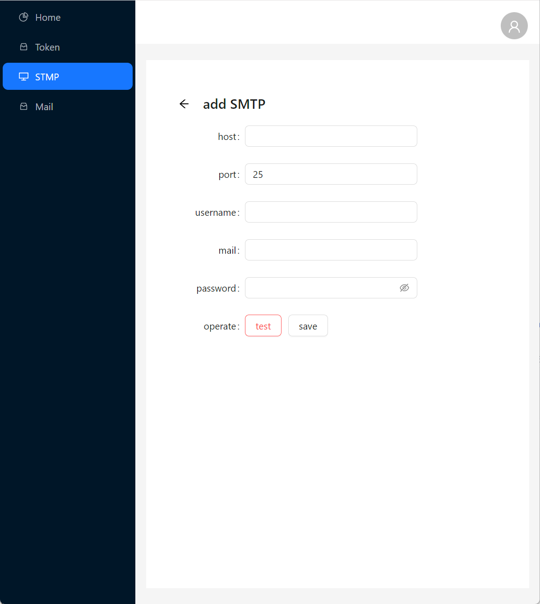
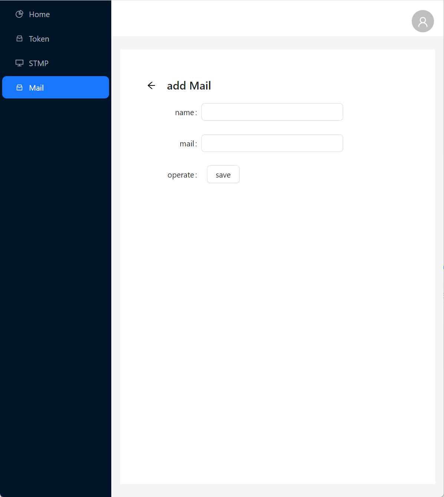

**English**🌎 | [**简体中文**🀄](./README_zh.md)

In the project, emails are often used to notify exception logs. However, this usually requires configuring SMTP within the project and providing the email address for receiving emails. When the email address changes, it necessitates modifying the project's configuration file. Additionally, due to network restrictions, it may be impossible to configure SMTP.

This program can replace SMTP with an HTTP interface, simplifying the process of sending emails. You only need to configure SMTP and the email address for receiving emails on the management page to achieve email sending via HTTP.

Supports GET and POST requests.

**GET Request Example**:

```powershell
curl 'http://127.0.0.1:12567/sendMail?token=99eaf30feb23e28057367431d820cf319915792921d9cf21b5f761fb75433225&content=this%20is%20a%20test'
```

**POST Request Example**:

```powershell
curl -X POST 'http://127.0.0.1:12567/sendMail' \
--header 'Content-Type: application/x-www-form-urlencoded' \
--data-urlencode 'token=99eaf30feb23e28057367431d820cf319915792921d9cf21b5f761fb75433225' \
--data-urlencode 'content=this%20is%20a%20test'
```

**Example of Sending an Email with Attachments**:

```powershell
curl -X POST 'http://127.0.0.1:12567/sendMail' \
--form 'files=@"/111111.txt"' \
--form 'files=@"/22222222222222.txt"' \
--form 'token=d6a1ee40c5bad981461643f5404a305a2e3f480cc6fcf65ba98efb63ce32d471"' \
--form 'content=1212'
```

This method is essentially a simple form submission, making it easy for different languages and platforms to use this project.

**Parameter Description**:

- `token`: Manually added in the management interface, it is the unique value bound with SMTP and the receiving email address.
- `content`: The content of the email.
- `subject`: The subject of the email. If a subject is set when the token is generated, it will be used as the default subject if this parameter is empty.
- `files`: The attachments to be sent, supports multiple files.

**Usage Method**:

You can directly download the compiled version from the following link:

[Download from GitHub](https://github.com/chuccp/smtp2http/releases)

or

```
curl -uri "https://github.com/chuccp/smtp2http/releases/latest/download/smtp2http-windows-amd64.tar.gz" -o smtp2http-windows-amd64.tar.gz
```

docker Images
```
docker pull cooge123/smtp2http
```


After downloading and extracting, you can run it directly. The default port number is 12566. After the program runs, it will generate a configuration file where you can modify the port number. After modification, restart the program to use the new port number.

After starting, you can enter the management interface by opening a browser to `http://127.0.0.1:12566`.

**Configuration File Description**:

After the program runs, it automatically generates a configuration file, including the following sections:

```
[core]
init      = true   # Whether initialization is complete, default is false
cachePath = .cache  # Temporary cache path for email sending files
dbType    = sqlite  # Database type, currently supports sqlite and mysql

[sqlite]
filename = d-mail.db  # SQLite file path

[manage]
port     = 12566      # Port number for backend management
username = 111111     # Backend management account
password = 111111     # Backend management password
webPath  = web        # Static file path

[api]
port = 12566          # Port number for sending emails, if you do not want to share the port number with the management backend, you can change it to another port number

[mysql]
host     = 127.0.0.1  # MySQL host address
port     = 3306       # MySQL port number
dbname   = d_mail     # MySQL database name
charset  = utf8       # Encoding format, default is utf8
username = root       # MySQL account
password = 123456     # MySQL password
```

---

**Compilation Instructions**:

If you wish to compile the project yourself, you will need to compile not only this project but also the web page found at https://github.com/chuccp/d-mail-view.


**Software Operation**:

When you first enter the management backend, you need to configure the database and the backend management account. Currently, SQLite and MySQL databases are supported.


Add SMTP address:



Add the email address for receiving emails:



Add Token:


After the configuration is complete, you can use the Token to send messages to the email.

